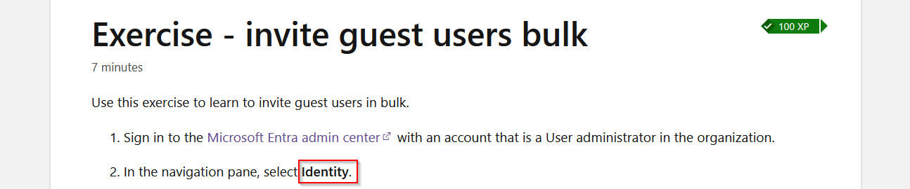
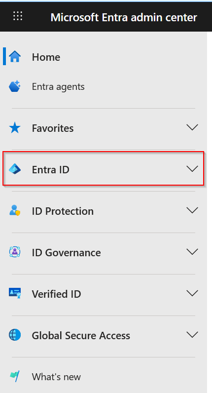

# Finding 01 – Identity Navigation Replaced by Entra ID

## Source

Microsoft Learn – [Identity and Access Administrator Career Path](https://learn.microsoft.com/en-us/training/career-paths/identity-and-access-admin)

Platform: [Microsoft Entra Admin Center](https://entra.microsoft.com/)

---

## Issue Summary

Multiple Microsoft Learn exercises reference a navigation section called **Identity**.

In the current Microsoft Entra Admin Center interface, this section no longer exists.

The correct navigation option is **Entra ID**.

---

## Correct Navigation

####Original instruction:

"In the menu on the left expand the Identity section."

####Updated instruction:

"In the left navigation pane, select **Entra ID**."

---

## Root Cause

The Microsoft Entra Admin Center interface has been updated and the navigation terminology has changed.

Some Microsoft Learn exercises still reference the previous interface.

---

## Evidence

### Microsoft Learn Instruction Referencing "Identity"

### Current Entra Admin Center Navigation

---

## Verification

Observed in the Microsoft Entra Admin Center interface (March, 2026).

---

## Affected Exercises

The following exercises contain this issue:

- Add a new user
- Invite guest users in bulk
- Assign roles to users
- Manage guest users
- Review audit logs
